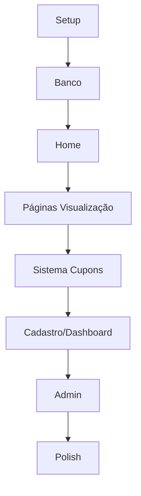

# PROJECT_ROADMAP.md - PLANO MASTER DO PROJETO
<!-- CRIADO: 14/09/2025 14:59 com Product Owner -->
<!-- VERSÃO: 1.0 FINAL -->

## 📋 VISÃO GERAL DO PROJETO
```yaml
Projeto: Guia Marajoara - Diretório Digital do Bairro
Cliente: Mari Carreira + FMAD Local Marketing
Objetivo: Conectar 200k moradores aos 5000+ comércios locais via cupons digitais
Prazo: 10 dias úteis (14/09 - 27/09/2025)
Budget: R$ 15.000
Stack: Next.js 14, TypeScript, Tailwind CSS v3, Supabase, Vercel
Abordagem: MOBILE FIRST OBRIGATÓRIO
```

## 🎨 IDENTIDADE VISUAL DEFINIDA
```yaml
Cores:
  Rosa Principal: #C2227A
  Verde CTA/Cupons: #8BC34A  
  Ciano Destaques: #00BCD4
  Background: #F8F9FA
  Texto Principal: #1A1A1A
  Texto Secundário: #6B7280

Breakpoints Mobile First:
  Base: 320px (mobile)
  sm: 640px
  md: 768px (tablet)
  lg: 1024px (desktop)
  xl: 1280px
```

## 🎯 ENTREGÁVEIS PRINCIPAIS
| Entregável | Criticidade | Complexidade | Status | Progresso |
|------------|-------------|--------------|---------|-----------|
| Setup + Componentes Base | CRÍTICO | Baixa | ⏳ Pendente | 0% |
| Banco de Dados (11 tabelas) | CRÍTICO | Média | ⏳ Pendente | 0% |
| Home Page Completa | CRÍTICO | Média | ⏳ Pendente | 0% |
| Sistema de Busca Fuzzy | CRÍTICO | Alta | ⏳ Pendente | 0% |
| Listagem/Detalhes Empresas | CRÍTICO | Média | ⏳ Pendente | 0% |
| Sistema de Cupons | CRÍTICO | Alta | ⏳ Pendente | 0% |
| Cadastro Multi-step | ALTO | Alta | ⏳ Pendente | 0% |
| WhatsApp Integration | ALTO | Alta | ⏳ Pendente | 0% |
| Dashboard Parceiro | MÉDIO | Média | ⏳ Pendente | 0% |
| Admin FMAD | MÉDIO | Média | ⏳ Pendente | 0% |

## 📅 FASES DO PROJETO

### FASE 0: FUNDAÇÃO MOBILE FIRST (Dia 1 - 14/09) ⏳ 0%
- [ ] Setup Next.js 14 com TypeScript
- [ ] Configurar Tailwind CSS v3 (NÃO v4!)
- [ ] Setup Supabase (projeto + conexão)
- [ ] Criar componentes base MOBILE FIRST:
  - [ ] Button (todos os variants)
  - [ ] Card (empresas, cupons)
  - [ ] Input/SearchBar
  - [ ] Modal (mobile fullscreen)
  - [ ] Toast notifications
  - [ ] Loading states
  - [ ] Skeleton loaders
- [ ] Layout base (Navbar mobile + desktop)
- [ ] Deploy inicial Vercel

### FASE 1: BANCO DE DADOS (Dia 2 - 15/09) ⏳ 0%
```sql
Tabelas a criar:
1. businesses (45 campos)
2. categories (8 campos)
3. business_hours
4. business_categories (N:N)
5. coupons (20 campos)
6. coupon_redemptions
7. users (clientes)
8. reviews
9. analytics_events
10. waitlist
11. contact_messages
```
- [ ] Schema completo com RLS
- [ ] Função smart_search (fuzzy)
- [ ] Popular categorias (Vestuário, PET, Imóvel, etc)
- [ ] Seed 20 empresas teste
- [ ] Gerar TypeScript types

### FASE 2: HOME PAGE COMPLETA (Dias 3-4 - 16-17/09) ⏳ 0%
**Componentes da Home (ordem de desenvolvimento):**
- [ ] Topbar com mensagens rotativas
- [ ] Navbar sticky com mobile drawer
- [ ] Hero Section:
  - [ ] Logo "GUIA DO Marajoara"
  - [ ] SearchBox com placeholders rotativos
  - [ ] Grid categorias (mobile 3x2, desktop carousel)
  - [ ] Contadores animados
- [ ] Seção Empresas Recentes (cards horizontais)
- [ ] Seção Cupons Ativos (grid responsivo)
- [ ] Seção Mari Carreira (mobile: conteúdo primeiro)
- [ ] Footer com newsletter
- [ ] WhatsApp button flutuante

### FASE 3: PÁGINAS DE VISUALIZAÇÃO (Dia 5 - 18/09) ⏳ 0%
- [ ] `/empresas` - Listagem com filtros
- [ ] `/empresas/[slug]` - Detalhes completos
- [ ] `/categorias/[slug]` - Empresas por categoria
- [ ] `/busca` - Resultados com fuzzy search
- [ ] `/cupons` - Todos os cupons ativos

### FASE 4: SISTEMA DE CUPONS (Dia 6 - 19/09) ⏳ 0%
- [ ] Modal de resgate (mobile first)
- [ ] Captura leads (Nome + WhatsApp)
- [ ] Validação por plano (5 basic, 10 premium)
- [ ] Código único por resgate
- [ ] Integração WhatsApp para envio

### FASE 5: CADASTRO E DASHBOARD (Dias 7-8 - 20-23/09) ⏳ 0%
**Páginas a criar:**
- [ ] `/cadastro` - Multi-step form:
  - [ ] Step 1: Dados básicos
  - [ ] Step 2: Endereço
  - [ ] Step 3: Horários
  - [ ] Step 4: Categorias
  - [ ] Step 5: Upload logo
  - [ ] Step 6: Escolha plano
- [ ] `/login` - Página de acesso
- [ ] `/dashboard` - Visão geral parceiro
- [ ] `/dashboard/cupons` - Gerenciar cupons
- [ ] `/dashboard/perfil` - Editar dados

### FASE 6: ADMIN E INTEGRAÇÕES (Dia 9 - 24/09) ⏳ 0%
- [ ] `/admin` - Painel FMAD
- [ ] `/admin/empresas` - Aprovar/gerenciar
- [ ] `/admin/relatorios` - Analytics
- [ ] WhatsApp Evolution API setup
- [ ] Sistema de notificações

### FASE 7: POLISH E OTIMIZAÇÃO (Dia 10 - 25/09) ⏳ 0%
**Páginas finais:**
- [ ] `/como-funciona`
- [ ] `/contato`
- [ ] `/termos`
- [ ] `/privacidade`

**Otimizações:**
- [ ] SEO completo
- [ ] Performance 90+ PageSpeed
- [ ] PWA manifest
- [ ] Testes finais
- [ ] Deploy produção

## 🔄 DEPENDÊNCIAS CRÍTICAS


## 📊 MÉTRICAS DE PROGRESSO

### PROGRESSO GERAL: ░░░░░░░░░░░░░░░░░░░░ 0%

### POR ÁREA:
- Backend: ░░░░░░░░░░░░░░░░░░░░ 0%
- Frontend: ░░░░░░░░░░░░░░░░░░░░ 0%
- Mobile: ░░░░░░░░░░░░░░░░░░░░ 0%
- Páginas: 0/15 concluídas

## 🚨 RISCOS IDENTIFICADOS
| Risco | Probabilidade | Impacto | Mitigação |
|-------|---------------|---------|-----------|
| Complexidade mobile first | Média | Alto | Testar em devices reais sempre |
| Prazo 10 dias | Alta | Crítico | MVP primeiro, polish depois |
| WhatsApp API | Média | Alto | Evolution API já disponível |

## 🎯 DEFINIÇÃO DE PRONTO (DoD)
- [ ] Mobile first (320px funcionando)
- [ ] Desktop responsivo
- [ ] Loading states
- [ ] Erro handling
- [ ] Acessível
- [ ] Testado em devices reais
- [ ] Deploy Vercel OK